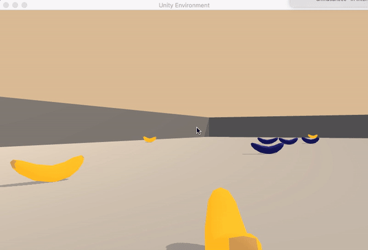

# Navigation
Deep Reinforcement Learning Nanodegree Project 1

## Project description
For this project, the task is to train an agent to navigate (and collect bananas) in a large, square world. 

* Goal: A reward of +1 is provided for collecting a yellow banana, and a reward of -1 is provided for collecting a blue banana. Thus, the goal is to collect as many yellow bananas as possible while avoiding blue bananas.

* State space is 37 dimensional and contains the agent's velocity, along with ray-based perception of objects around the agent's forward direction.

* Action space is 4 dimentional. Four discrete actions correspond to:

	* 0 - move forward
	* 1 - move backward
	* 2 - move left
	* 3 - move right
* Solution criteria: the environment is considered as solved when the agent gets an average score of +13 over 100 consecutive episodes.

## Getting started
### Configuration
PC configuration used for this project:

* OS: Mac OS 11.3 El Capitan
* Processor: 1.3 GHz Intel Core i5
* Memory: 4GB 1600MHz DDR3
* Graphics: Intel HD Graphics 5000 1536MB

### Environment setup
For detailed Python environment setup (PyTorch, Unity Environment, and a few more Python packages) please follow these steps: [link](https://github.com/udacity/deep-reinforcement-learning#dependencies) 

### Structure
All project files are structed as follows:

* model.py - It contains the neural network architecture.
* dqn_agent.py - It contains agent and replay buffer class implementation. agent class interacts with and learns from the environment. replay buffer class has a fixed-size buffer to store experience tuples.
* checkpoint_dqn1.pth- It contains the trained model weights.
* Report.md- Explains the algorithm used and ideas for future improvement.
* README.md- It describes the project environment details, installation instruction and training code.
* images- This folder contains diiferent images used in the project.
* Banana.app- It contains the built in unity environment used in the project.
* Navigation.ipynb- This notebook contains training code for the agent and our solution for this environment.