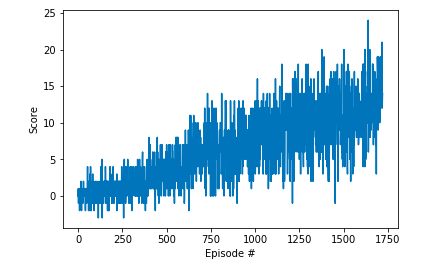

# Project report
### Learning algorithm

The learning algorithm used is vanilla Deep Q Learning as described in the [original paper](https://storage.googleapis.com/deepmind-media/dqn/DQNNaturePaper.pdf). Deep neural network is used instead of convolutional neural network, as we have used vector of states instead of images. 

The pseudo-code of this agorithm is given below from the udacity [lecture](https://www.youtube.com/watch?v=MqTXoCxQ_eY):


Different enhancements of the original vanilla DQN are proposed so far, such as Prioritized Experience Replay [(paper)](https://arxiv.org/abs/1511.05952) ,Double Deep Q Networks [(paper)](https://arxiv.org/abs/1509.06461) and Dueling Deep Q Networks [(paper)](https://arxiv.org/abs/1511.06581). In this project we are going to implement Dueling Deep Q Networks. The core idea of Dueling Deep Q Networks is to use two streams: one that estimates the state value function and the other that estimates the advantage of each action. This two streams share same layers at the beginning, then branch off with their own fully connected layers. Finally the desired Q values are obtained by by combining the state and advantage values.

### Parameters used in DQN algorithm:

* Maximum steps per episode: 1000
* Starting epsilion: 1.0
* Ending epsilion: 0.01
* Epsilion decay rate: 0.999
* replay buffer size (N): 1000000  
* minibatch size: 128         
* discount factor: 0.99            
* for soft update of target parameters (TAU): 0.001              
* learning rate: 0.0005               
* how often to update the network (C): 32        

### Network Architecture

The dueling DQN used in our implementation has the following architecture:

Branch1      |(in,out)|Layer        | (in, out) | Batchnorm | Activation|Branch2  |(in,out)      
------------ | -------|-------------|-----------|-----------|-----------|---------|--------
-|-|Layer 1 | (State_size,64)|yes|ReLU|-|-
-|-|Layer 2 | (64,128)|yes|ReLU|-|-
-|-|Layer 3 | (128,64)|yes|ReLU|-|-
-|-|Layer 4 | (64,32)|yes|ReLU|-|-
Advantage| (32,Action_size)|-|-|-|-|State|(32,1)

Finally, the advantage branch and state branch are combined to get the desired Q values.

### Results



```
EEpisode 100	Average Score: 0.28
Episode 200		Average Score: 0.56
Episode 300		Average Score: 1.07
Episode 400		Average Score: 1.60
Episode 500		Average Score: 2.95
Episode 600		Average Score: 3.76
Episode 700		Average Score: 5.28
Episode 800		Average Score: 6.08
Episode 900		Average Score: 5.87
Episode 1000	Average Score: 7.62
Episode 1100	Average Score: 8.33
Episode 1200	Average Score: 8.98
Episode 1300	Average Score: 9.82
Episode 1400	Average Score: 10.02
Episode 1500	Average Score: 10.83
Episode 1600	Average Score: 11.09
Episode 1700	Average Score: 12.67
Episode 1721	Average Score: 13.07
Environment solved in 1621 episodes!	Average Score: 13.07
```


### Ideas for future work
1. Prioritized Experience Replay [paper](https://arxiv.org/abs/1511.05952)
1. Double Deep Q Networks [paper](https://arxiv.org/abs/1509.06461)
1. Learning from multi-step bootstrap targets [paper](https://arxiv.org/abs/1611.05397)
1. Distributional DQN [paper](https://arxiv.org/abs/1707.06887)
1. Noisy DQN [paper](https://arxiv.org/abs/1706.10295)
1. RAINBOW [Paper](https://arxiv.org/abs/1710.02298)
1. Learning from images
