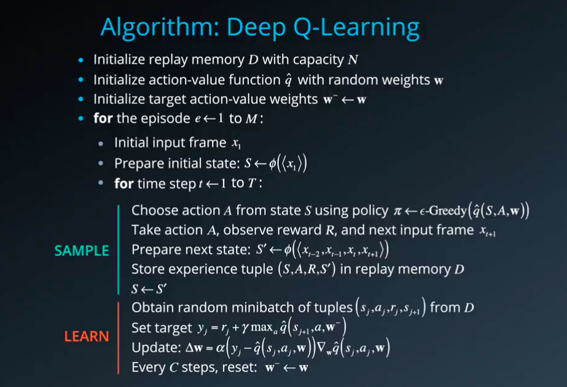
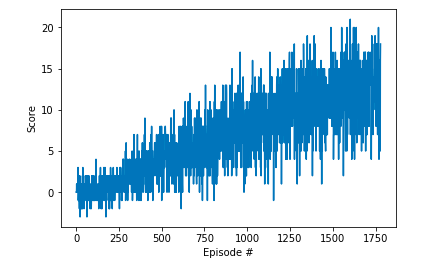

# Project report
### Learning algorithm

The learning algorithm used is vanilla Deep Q Learning as described in the [original paper](https://storage.googleapis.com/deepmind-media/dqn/DQNNaturePaper.pdf). As batch of vector of state is used as input instead of an image, so convolutional neural nework is replaced with deep neural network. 

The pseudo-code of this agorithm is given below from the udacity lecture:

### Parameters used in DQN algorithm:

* Maximum steps per episode: 1000
* Starting epsilion: 1.0
* Ending epsilion: 0.01
* Epsilion decay rate: 0.999
* replay buffer size (N): 1000000  
* minibatch size: 128         
* discount factor: 0.99            
* for soft update of target parameters (TAU): 0.001              
* learning rate: 0.0005               
* how often to update the network (C): 32        

### Network Architecture
The deep neural network has following layers:

Layer        | (in, out)        | Batchnorm | Activation      
------------ | -----------------|-----------|------------
Layer 1 | (State_size,128)|yes|ReLU
Layer 2 | (128,64)|yes|ReLU
Layer 3 | (64,Action_size)|-|-

### Results

`<Episode 100	Average Score: 0.14>` 
`Episode 200	Average Score: 0.39` 
`Episode 300	Average Score: 1.15` 
`Episode 400	Average Score: 2.24` 
`Episode 500	Average Score: 3.36` 
`Episode 600	Average Score: 3.93` 
`Episode 700	Average Score: 4.91` 
`Episode 800	Average Score: 5.51` 
`Episode 900	Average Score: 6.93` 
`Episode 1000	Average Score: 7.64` 
`Episode 1100	Average Score: 8.15` 
`Episode 1200	Average Score: 8.61` 
`Episode 1300	Average Score: 10.31` 
`Episode 1400	Average Score: 10.79` 
`Episode 1500	Average Score: 10.89` 
`Episode 1600	Average Score: 11.81` 
`Episode 1700	Average Score: 12.40` 
`Episode 1780	Average Score: 13.02` 
`Environment solved in 1680 episodes!	Average Score: 13.02` 

### Ideas for future work
1. Prioritized Experience Replay [paper](https://arxiv.org/abs/1511.05952)
1. Double Deep Q Networks [paper](https://arxiv.org/abs/1509.06461)
1. Dueling Deep Q Networks [paper](https://arxiv.org/abs/1511.06581)
1. Learning from multi-step bootstrap targets paper
1. Distributional DQN [paper](https://arxiv.org/abs/1707.06887)
1. Noisy DQN [paper](https://arxiv.org/abs/1706.10295)
1. RAINBOW [Paper](https://arxiv.org/abs/1710.02298)
1. Learning from images
